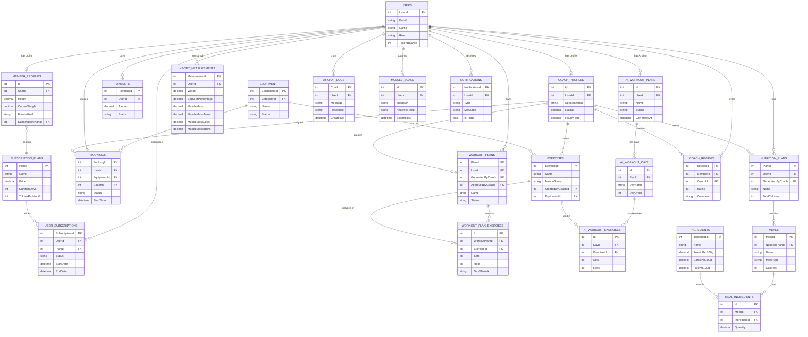

# IntelliFit Entity Relationship Diagram

```mermaid
erDiagram

    USERS {
        int     UserId     PK
        string  Email
        string  Name
        string  Role
        int     TokenBalance
    }

    MEMBER_PROFILES {
        int     Id              PK
        int     UserId          FK
        decimal Height
        decimal CurrentWeight
        string  FitnessGoal
        int     SubscriptionPlanId FK
    }

    COACH_PROFILES {
        int     Id              PK
        int     UserId          FK
        string  Specialization
        decimal Rating
        decimal HourlyRate
    }

    SUBSCRIPTION_PLANS {
        int     PlanId          PK
        string  Name
        decimal Price
        int     DurationDays
        int     TokensPerMonth
    }

    USER_SUBSCRIPTIONS {
        int      SubscriptionId  PK
        int      UserId          FK
        int      PlanId          FK
        string   Status
        datetime StartDate
        datetime EndDate
    }

    PAYMENTS {
        int      PaymentId  PK
        int      UserId     FK
        decimal  Amount
        string   Status
    }

    EQUIPMENT {
        int     EquipmentId  PK
        int     CategoryId   FK
        string  Name
        string  Status
    }

    BOOKINGS {
        int      BookingId   PK
        int      UserId      FK
        int      EquipmentId FK
        int      CoachId     FK
        string   Status
        datetime StartTime
    }

    INBODY_MEASUREMENTS {
        int     MeasurementId       PK
        int     UserId              FK
        decimal Weight
        decimal BodyFatPercentage
        decimal MuscleMass
        decimal MuscleMassArms
        decimal MuscleMassLegs
        decimal MuscleMassTrunk
    }

    EXERCISES {
        int    ExerciseId       PK
        string Name
        string MuscleGroup
        int    CreatedByCoachId FK
        int    EquipmentId      FK
    }

    WORKOUT_PLANS {
        int    PlanId           PK
        int    UserId           FK
        int    GeneratedByCoach FK
        int    ApprovedByCoach  FK
        string Name
        string Status
    }

    WORKOUT_PLAN_EXERCISES {
        int    Id            PK
        int    WorkoutPlanId FK
        int    ExerciseId    FK
        int    Sets
        int    Reps
        string DayOfWeek
    }

    AI_WORKOUT_PLANS {
        int      Id          PK
        int      UserId      FK
        string   Name
        string   Status
        datetime GeneratedAt
    }

    AI_WORKOUT_DAYS {
        int    Id       PK
        int    PlanId   FK
        string DayName
        int    DayOrder
    }

    AI_WORKOUT_EXERCISES {
        int Id          PK
        int DayId       FK
        int ExerciseId  FK
        int Sets
        int Reps
    }

    NUTRITION_PLANS {
        int    PlanId           PK
        int    UserId           FK
        int    GeneratedByCoach FK
        string Name
        int    TotalCalories
    }

    MEALS {
        int    MealId          PK
        int    NutritionPlanId FK
        string Name
        string MealType
        int    Calories
    }

    INGREDIENTS {
        int     IngredientId   PK
        string  Name
        decimal ProteinPer100g
        decimal CarbsPer100g
        decimal FatsPer100g
    }

    MEAL_INGREDIENTS {
        int     Id           PK
        int     MealId       FK
        int     IngredientId FK
        decimal Quantity
    }

    AI_CHAT_LOGS {
        int      ChatId    PK
        int      UserId    FK
        string   Message
        string   Response
        datetime CreatedAt
    }

    MUSCLE_SCANS {
        int      Id             PK
        int      UserId         FK
        string   ImageUrl
        string   AnalysisResult
        datetime ScannedAt
    }

    NOTIFICATIONS {
        int    NotificationId PK
        int    UserId         FK
        string Type
        string Message
        bool   IsRead
    }

    COACH_REVIEWS {
        int    ReviewId PK
        int    MemberId FK
        int    CoachId  FK
        int    Rating
        string Comment
    }

    %%  USERS / PROFILES
    USERS ||--o| MEMBER_PROFILES      : "has profile"
    USERS ||--o| COACH_PROFILES       : "has profile"

    %%  BILLING
    USERS              ||--o{ USER_SUBSCRIPTIONS : "subscribes"
    SUBSCRIPTION_PLANS ||--o{ USER_SUBSCRIPTIONS : "defines"
    MEMBER_PROFILES    }o--|| SUBSCRIPTION_PLANS : "on plan"
    USERS              ||--o{ PAYMENTS           : "pays"

    %%  EQUIPMENT & BOOKING
    EQUIPMENT      ||--o{ BOOKINGS : "booked"
    USERS          ||--o{ BOOKINGS : "makes"
    COACH_PROFILES ||--o{ BOOKINGS : "assigned"

    %%  HEALTH
    USERS ||--o{ INBODY_MEASUREMENTS : "measured"
    USERS ||--o{ MUSCLE_SCANS        : "scanned"

    %%  EXERCISES
    COACH_PROFILES ||--o{ EXERCISES : "creates"
    EQUIPMENT      ||--o{ EXERCISES : "used in"

    %%  COACH WORKOUT PLANS
    USERS          ||--o{ WORKOUT_PLANS          : "owns"
    COACH_PROFILES ||--o{ WORKOUT_PLANS          : "creates"
    WORKOUT_PLANS  ||--o{ WORKOUT_PLAN_EXERCISES : "contains"
    EXERCISES      ||--o{ WORKOUT_PLAN_EXERCISES : "included in"

    %%  AI WORKOUT PLANS
    USERS            ||--o{ AI_WORKOUT_PLANS    : "has AI plan"
    AI_WORKOUT_PLANS  ||--o{ AI_WORKOUT_DAYS    : "has days"
    AI_WORKOUT_DAYS   ||--o{ AI_WORKOUT_EXERCISES : "has exercises"
    EXERCISES         ||--o{ AI_WORKOUT_EXERCISES : "used in"

    %%  NUTRITION
    USERS           ||--o{ NUTRITION_PLANS  : "has"
    COACH_PROFILES  ||--o{ NUTRITION_PLANS  : "creates"
    NUTRITION_PLANS ||--o{ MEALS            : "contains"
    MEALS           ||--o{ MEAL_INGREDIENTS : "has"
    INGREDIENTS     ||--o{ MEAL_INGREDIENTS : "used in"

    %%  AI CHAT
    USERS ||--o{ AI_CHAT_LOGS : "chats"

    %%  SYSTEM
    USERS          ||--o{ NOTIFICATIONS : "receives"
    USERS          ||--o{ COACH_REVIEWS : "writes"
    COACH_PROFILES ||--o{ COACH_REVIEWS : "receives"
```
